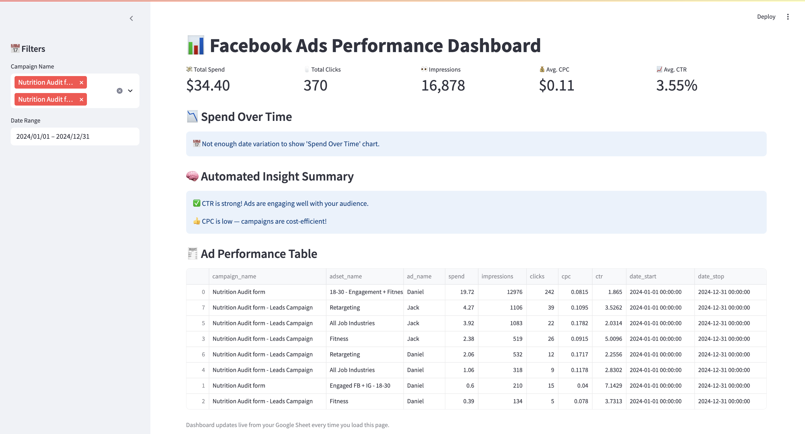

# 📊 Facebook Ads Performance Dashboard

This project automates the extraction of Facebook Ads data via the Meta Marketing API, pushes it to Google Sheets, and visualizes it with a live Streamlit dashboard.

> 🔐 Fully secured with `.env` variables — ready for GitHub and public demos.

---

## ✨ Features

- 🔁 Pulls ad data from **Facebook Ads API**
- 📄 Stores performance data in a **Google Sheet**
- 📊 Interactive dashboard built with **Streamlit**
- 📅 Date & campaign filters
- 💡 Smart summary panel with rule-based insights (CTR, CPC, etc.)
- ✅ `.env`-based secret handling (API key + credentials never exposed)

---

## 📂 Project Structure

📁 Facebook Ads Dashboard/
├── dashboard.py               # Streamlit app (reads from Google Sheet)
├── Facebook API               # Script to pull data from Facebook API → Google Sheet
├── requirements.txt           # Python dependencies
├── .gitignore                 # Excludes .env and secrets
└── README.md                  # You’re reading it!

---

## 🔧 Setup Instructions

1. Clone the Repo

git clone https://github.com/yourusername/facebook-ads-dashboard.git
cd facebook-ads-dashboard

2. Install Dependencies

pip install -r requirements.txt

3. Set Up Environment Variables

ACCESS_TOKEN=your_facebook_access_token
AD_ACCOUNT_ID=act_1234567890
CREDS_PATH=/absolute/path/to/your/credentials.json
SPREADSHEET_ID=your_google_sheet_id

---
## 🚀 How to Use

1. Launch the Dashboard

streamlit run dashboard.py

Open your browser at: http://localhost:8501

2. Refresh Ad Data from Facebook

python "Facebook API"

This will pull ad-level performance data from Facebook and upload it to your Google Sheet.

--
## 🌍 Deployment Options
Deploy publicly using:

Streamlit Cloud (free): https://streamlit.io/cloud

Render: https://render.com

Add your secrets via their "Secrets" manager

--
📸 Screenshot

## 👤 Author
Jack Attard Cassar

Performance Marketing & Automation Specialist

## 🧠 Future Enhancements
- Creative-level performance tracking (by image/video)
- GPT-powered summaries via LangChain
- Multi-account filtering
- Alerting via Slack/Email
